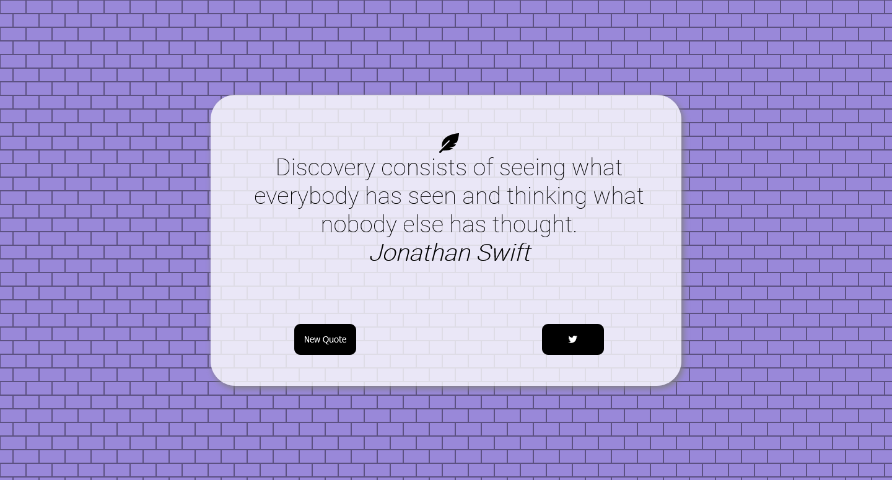

Users should be able to:

- View the optimal layout for the site depending on their device's screen size
- See hover states for all interactive elements on the page
- Switch between viewing Daily, Weekly, and Monthly stats

### Screenshot

### Built with

- Semantic HTML5 markup
- SCSS pre-processor
- Mobile-first workflow
